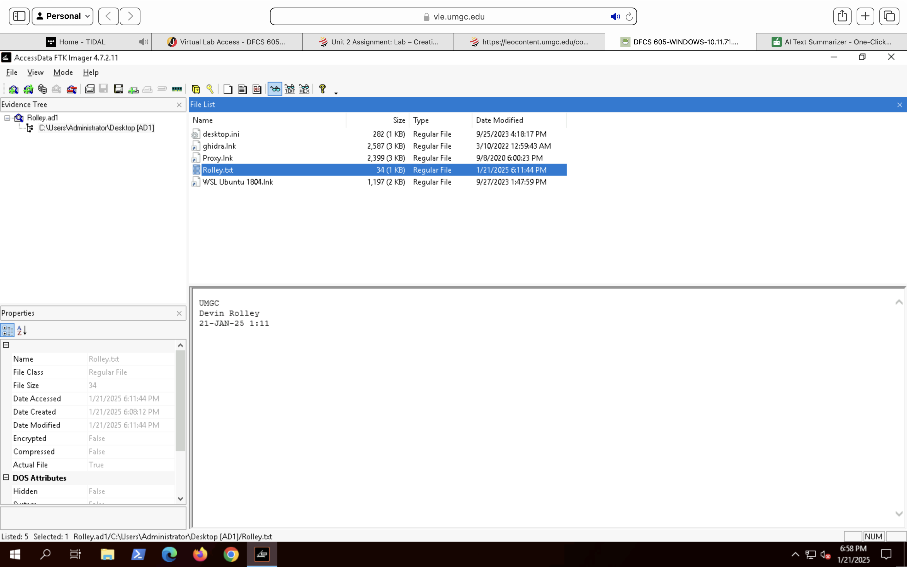

# Forensic Analysis

## Analysis Overview
This forensic analysis focused on identifying potentially malicious artifacts present on a USB storage device, validating file authenticity, reconstructing activity timelines, and correlating findings with threat intelligence. All analysis was conducted using forensically sound methods to preserve evidence integrity and support defensible conclusions.

---

## File System and Signature Analysis
The forensic image of the USB device was mounted and examined to enumerate files present on the media. File signature analysis was performed to compare file headers against associated file extensions to identify inconsistencies indicative of file masquerading or obfuscation.

Multiple files were identified with mismatched signatures and extensions, prompting deeper examination due to the increased likelihood of malicious intent.

**Supporting Evidence – Mounted Image File Listing:**  

**Supporting Evidence – File Metadata and Properties:**  

---

## Executable Artifact Examination
Executable files identified during enumeration were isolated for further analysis. File properties, structure, and headers were reviewed to assess legitimacy and identify characteristics consistent with malicious executables.

Cryptographic hash values were generated for identified artifacts to support reputation-based validation and external correlation.

---

## Threat Intelligence Correlation
Hash values associated with suspicious executables were compared against indicators provided in a recent threat intelligence report. This comparison identified matches between files recovered from the USB device and known malicious signatures, increasing confidence that the artifacts represented a security risk rather than benign files.

Threat intelligence correlation served as a key validation step in distinguishing confirmed malicious artifacts from false positives.

---

## Timestamp and Metadata Analysis
File metadata was examined to reconstruct activity related to file creation, modification, and access. Timestamp analysis indicated that multiple suspicious files were introduced within a narrow timeframe consistent with the reported incident window.

Additional metadata and security identifier (SID) information was reviewed to support assessment of likely user attribution and device usage context.

---

## Validation and Integrity Controls
Hash verification was performed at multiple stages throughout the investigation to ensure evidence integrity. Final hash values matched those recorded during initial acquisition, confirming that no alterations occurred during analysis.

These controls support the reliability and defensibility of all analytical conclusions.
