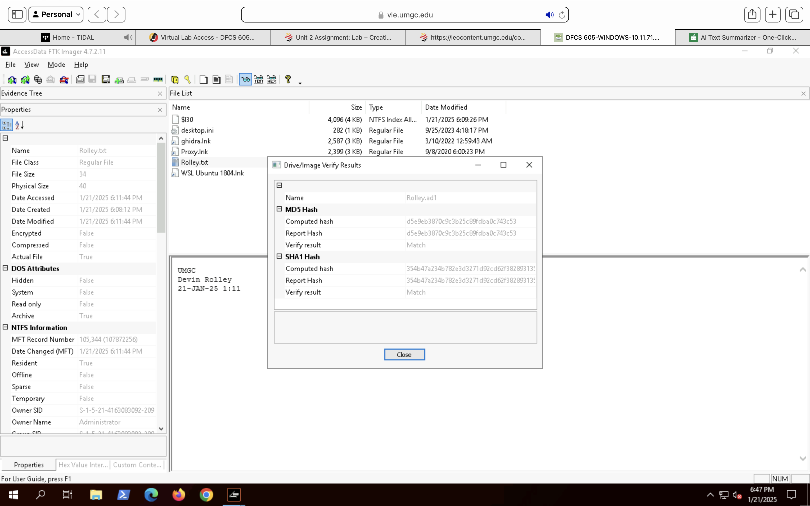

# Evidence and Integrity Validation

## Evidence Description
The primary evidence examined in this investigation consisted of a forensic image of a USB flash drive recovered from a corporate environment near shared workspaces used by the Sales and Marketing department. The device was collected following reports of suspicious activity and potential unauthorized software usage.

## Evidence Inventory
| Evidence Item | Description |
|--------------|-------------|
| USB Flash Drive Image | Forensic image of removable storage device acquired in E01 format |

## Evidence Integrity and Hash Verification
To ensure evidentiary integrity, cryptographic hash values were generated at the time of acquisition and re-verified after analysis. Hash validation confirmed that the evidence remained unchanged throughout the investigative process.

### Supporting Evidence – Image Hash Verification

### Supporting Evidence – Image Acquisition Summary

| Artifact | MD5 Hash | SHA-1 Hash |
|--------|----------|------------|
| USB Image (Initial Acquisition) | Documented | Documented |
| USB Image (Post-Analysis Verification) | Matched | Matched |

Matching hash values verified that no alteration occurred during analysis, preserving forensic soundness.

## Acquisition Methodology
The USB device was forensically imaged using industry-standard forensic tools in a controlled environment. Acquisition was performed using read-only access to prevent modification of source media. Hash values were calculated during acquisition and validated again following analysis to ensure integrity.

## Chain of Custody
A documented chain of custody was maintained throughout the investigation. Evidence handling followed established procedures from initial collection through forensic examination, ensuring accountability, traceability, and evidentiary reliability.

## Validation Summary
Evidence integrity was preserved for the duration of the investigation. All forensic procedures adhered to accepted digital forensics best practices, supporting the reliability and credibility of the findings presented in this case.
